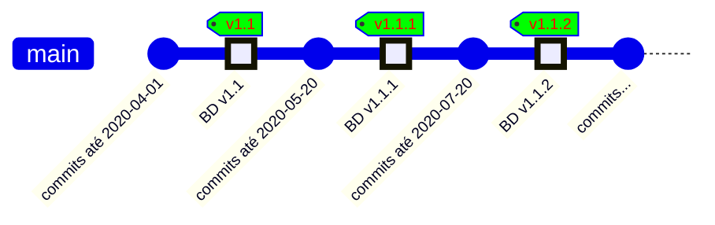
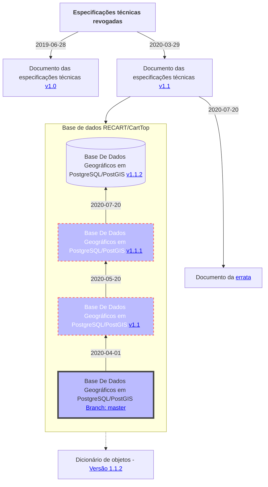

# recart-carttop-arquivo
Repositório das versões ANTIGAS das especificações técnicas CartTop

```mermaid
%%{init: { 'logLevel': 'debug', 'theme': 'default' , 'themeVariables': {
              'tagLabelColor': '#ff0000',
              'tagLabelBackground': '#00ff00',
              'tagLabelBorder': '#0000ff'
       } } }%%
    gitGraph LR:
       commit id: "commits até 2020-04-01"
       commit id: "BD v1.1" type: HIGHLIGHT tag: "v1.1"
       commit id: "commits até 2020-05-20"
       commit id: "BD v1.1.1" type: HIGHLIGHT tag: "v1.1.1"
       commit id: "commits até 2020-07-20"
       commit id: "BD v1.1.2" type: HIGHLIGHT tag: "v1.1.2"
       commit id: "commits..."
```

```mermaid
graph TD;
    id1["`**Especificações técnicas revogadas**`"]-->|2019-06-28|id2[Documento das especificações técnicas <a href=//github.com/dgterritorio/recart-carttop-arquivo/blob/main/v1.0/NormasEspecificacoesTecnicas-CartTopV1.0-20190628.pdf>v1.0</a>]
    id1["`**Especificações técnicas revogadas**`"]-->|2020-03-29|id3[Documento das especificações técnicas <a href=//github.com/dgterritorio/recart-carttop-arquivo/blob/main/v1.1/NormasEspecificacoesTecnicas-CartTop-V1.1-20200329.pdf>v1.1</a>]-->|2020-07-20|id4[Documento da <a href=//github.com/dgterritorio/recart-carttop-arquivo/blob/main/v1.1/NormasEspecificacoesTecnicas-Errata%20CartTop-V1.1-20200720.pdf>errata</a>]
    subgraph titulo1[Base de dados RECART/CartTop]
        direction BT
        style id5 fill:#bbf,stroke:#f66,stroke-width:2px,color:#fff,stroke-dasharray: 5 5
        style id6 fill:#bbf,stroke:#f66,stroke-width:2px,color:#fff,stroke-dasharray: 5 5
        style idmaster fill:#bbf,stroke:#444,stroke-width:4px       
        idmaster[Base De Dados Geográficos em PostgreSQL/PostGIS <a href=//github.com/dgterritorio/RECART>Branch: master</a>]-->|2020-04-01|id5[Base De Dados Geográficos em PostgreSQL/PostGIS <a href=//github.com/dgterritorio/RECART/releases/tag/v1.1>v1.1</a>]-->|2020-05-20|id6[Base De Dados Geográficos em PostgreSQL/PostGIS <a href=//github.com/dgterritorio/RECART/releases/tag/v1.1.1>v1.1.1</a>] -->|2020-07-20|id7[(Base De Dados Geográficos em PostgreSQL/PostGIS <a href=//github.com/dgterritorio/RECART/releases/tag/v1.1.2>v1.1.2</a>)]
    end
    id3[Documento das especificações técnicas <a href=//github.com/dgterritorio/recart-carttop-arquivo/blob/main/v1.1/NormasEspecificacoesTecnicas-CartTop-V1.1-20200329.pdf>v1.1</a>]--> titulo1[Base de dados RECART/CartTop]
    titulo1[Base de dados RECART/CartTop] -.-> idDicionario112[Dicionário de objetos - <a href=//www.dgterritorio.gov.pt/recart/v_1_1_2/recart.html>Versão 1.1.2</a>]
```
